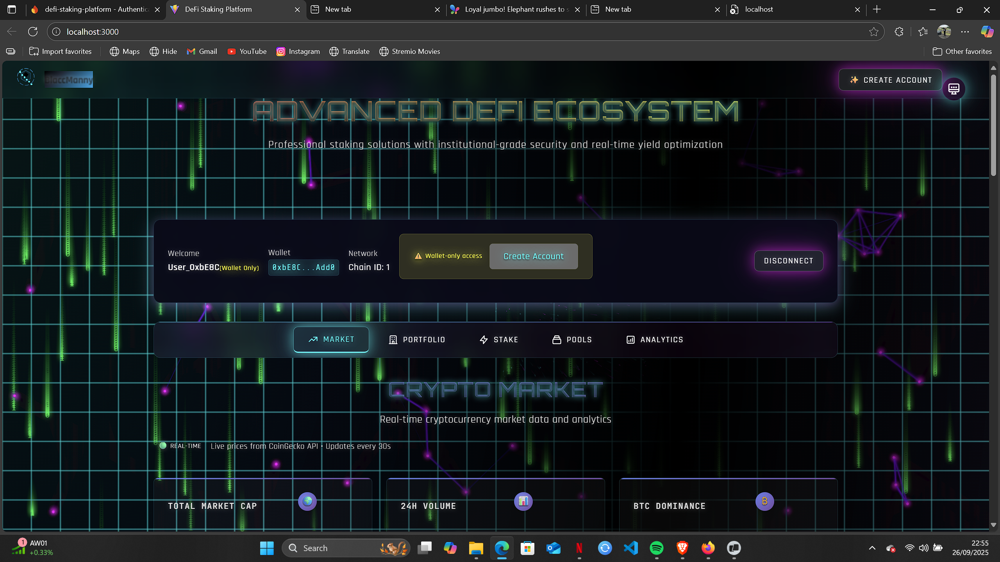
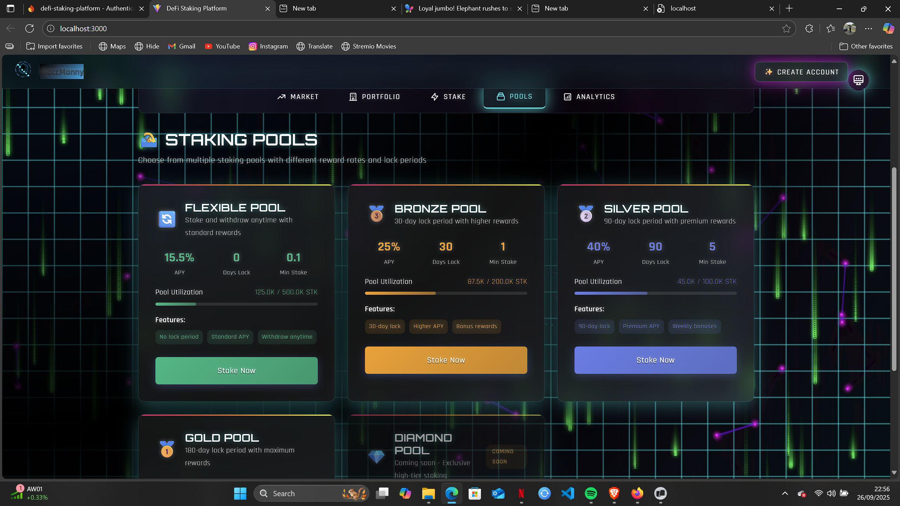
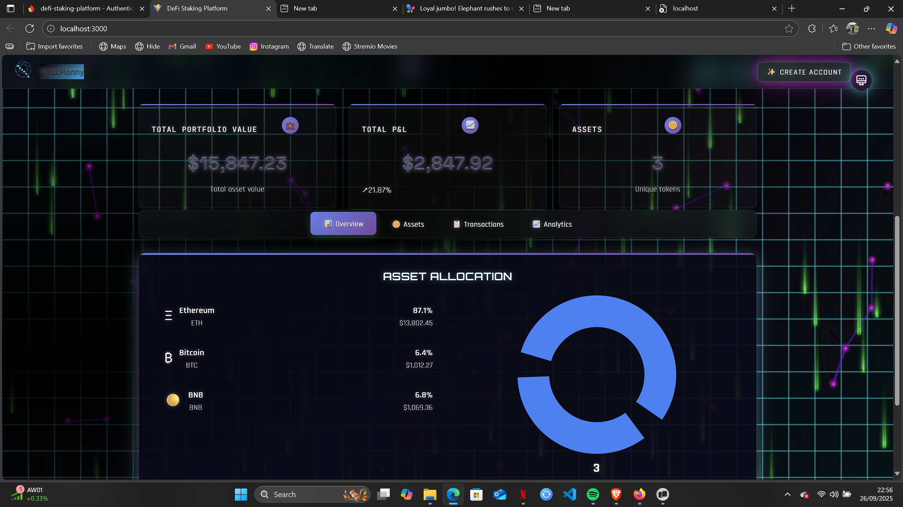
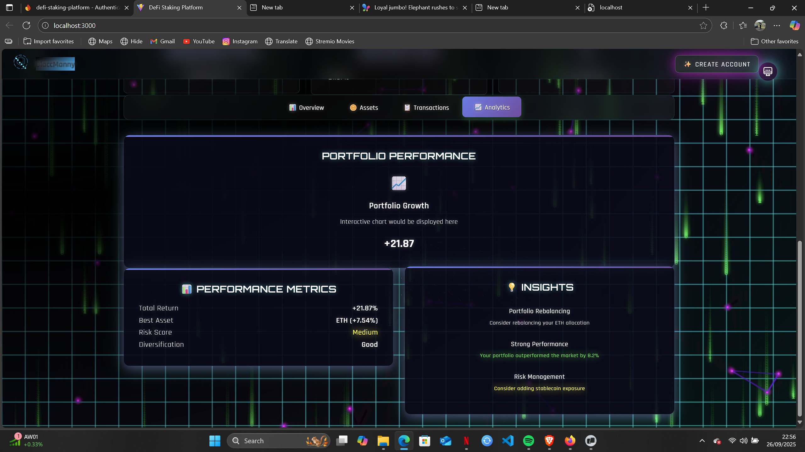
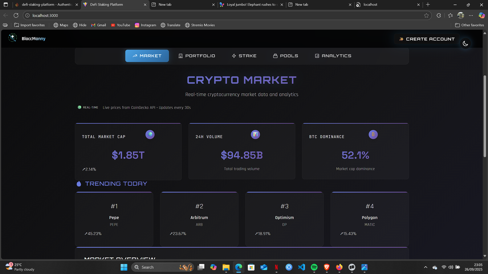
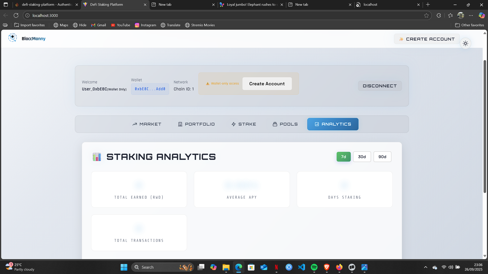

# 🌌 BlaccManny DeFi Staking Platform

**Advanced DeFi Ecosystem** - A cutting-edge decentralized finance platform featuring wallet-first authentication, comprehensive analytics dashboard, futuristic cyberpunk UI, and professional-grade staking solutions with institutional-level security and real-time yield optimization.

[](https://github.com/blaccdante/defi-staking-platform/stargazers)
[](https://github.com/blaccdante/defi-staking-platform/network/members)
[](https://github.com/blaccdante/defi-staking-platform/issues)
[](https://github.com/blaccdante/defi-staking-platform/blob/main/LICENSE)

    

## 🎯 Screenshots & Demo

### 🚀 Wallet Connection & Authentication

*Instant wallet connection with support for MetaMask, Trust Wallet, Binance Wallet, and Coinbase Wallet*

### 🌌 Cool Dashboard Interface  

*Cyberpunk-inspired UI with neon accents, holographic effects, and crystal-clear readability*

### 💼 Advanced Portfolio Management

*Real-time portfolio tracking with market data and yield optimization*

### ⚡ Professional Staking Interface

*Intuitive staking controls with real-time rewards calculation and security features*

### 🎨 Optional Account Creation

*Seamless account upgrade from wallet-only to full account with enhanced features*

### 🔮 Cyberpunk Theme Design

*Stunning cyberpunk aesthetics with enhanced visibility and professional appeal*

## 🎆 New Features & Enhancements

### 🚀 Wallet-First Authentication
- **Instant Access** - Connect wallet → immediate full platform access (no signup required)
- **Multi-Wallet Support** - MetaMask, Trust Wallet, Binance Wallet, Coinbase Wallet
- **Optional Account Creation** - Upgrade to full account anytime from top navigation
- **Dual Authentication** - Supports both wallet-only and email + wallet authentication
- **Seamless Experience** - 30-second onboarding vs traditional lengthy signups

### 🌌 Cool UI/UX Design
- **Cyberpunk Theme** - Stunning neon-accented interface with holographic effects
- **Enhanced Readability** - Crystal-clear text with optimized contrast and glow effects
- **Professional Typography** - Orbitron, Rajdhani, and Share Tech Mono fonts
- **Theme System** - Futuristic (default), Dark, and Light themes available
- **Responsive Design** - Perfect experience across all devices

### 🛡️ Advanced Security & Features
- **Firebase Integration** - Enterprise-grade user management and data persistence
- **Real-time Sync** - User preferences and data synced across devices  
- **Enhanced Error Handling** - Detailed error messages and troubleshooting guides
- **Performance Monitoring** - Built-in analytics and performance tracking
- **Account Management** - Profile settings, notifications, and social features

### 📱 Mobile Responsiveness & Cross-Platform
- **Mobile-First Design** - Optimized for smartphones and tablets with touch-friendly interfaces
- **Responsive Navigation** - Adaptive navigation system that works seamlessly across all device sizes
- **Touch Optimizations** - Enhanced touch interactions and mobile-specific UI components
- **Progressive Web App** - Mobile app-like experience directly in the browser
- **Cross-Platform Compatibility** - Works perfectly on iOS, Android, Windows, macOS, and Linux
- **Offline Capabilities** - Core functionality available even with limited connectivity

### 📊 Enhanced Portfolio & Analytics
- **Live Market Data** - Real-time crypto market dashboard integration
- **Portfolio Tracking** - Comprehensive portfolio management with yield optimization
- **Advanced Analytics** - Detailed staking performance and rewards analytics
- **Multi-Pool Support** - Staking pools with different risk/reward profiles

### 🔧 Admin Dashboard & Analytics
- **Comprehensive Analytics** - Firebase-powered wallet connection tracking and user behavior analysis
- **Real-time Monitoring** - Live dashboard showing daily connections, unique wallets, and platform usage
- **Wallet Intelligence** - Track wallet types (MetaMask, Trust, Binance, Coinbase), network usage, and user patterns
- **Admin Controls** - Professional admin interface for platform management and user insights
- **Session Management** - Detailed session tracking with connection duration and user engagement metrics
- **Search & Filter** - Advanced search functionality to find specific wallets and analyze user behavior
- **Privacy-Focused** - Collects only necessary analytics data while respecting user privacy

## ✨ Core Platform Features

### Smart Contracts
- **ERC20 Staking Token (STK)** - Token users can stake
- **ERC20 Reward Token (RWD)** - Token distributed as rewards  
- **TokenStaking Contract** - Main staking logic with:
  - Stake tokens to earn rewards
  - Time-based reward calculation (100 RWD per second per staked STK)
  - 7-day minimum staking period before withdrawal
  - Claim rewards functionality
  - Exit function (withdraw all + claim rewards)
  - Emergency recovery functions (owner only)

### Frontend
- **Modern React Interface** - Clean, responsive design with glass morphism effects
- **MetaMask Integration** - Connect wallet with automatic account detection
- **Real-time Stats** - Live display of staking stats and rewards
- **Transaction Handling** - Loading states and success/error notifications
- **Mobile Responsive** - Works on desktop and mobile devices

### Security Features
- **ReentrancyGuard** - Prevents reentrancy attacks
- **SafeERC20** - Safe token transfers
- **Minimum Staking Period** - 7-day lockup prevents flash loan attacks
- **Ownable** - Owner-only administrative functions

## 🔧 Advanced Tech Stack

### Frontend Architecture
- **React 18** - Modern component-based architecture with hooks
- **Vite** - Lightning-fast build tool and development server
- **ethers.js v6** - Latest Ethereum interaction library
- **Firebase 12.3** - Enterprise-grade authentication, database, and analytics
- **React Hot Toast** - Beautiful notification system
- **Custom Hooks** - Reusable logic for mobile forms and responsive design
- **Service Architecture** - Modular services for wallet analytics and user management

### Smart Contracts
- **Solidity 0.8.20** - Latest secure smart contract language
- **OpenZeppelin** - Battle-tested security implementations
- **Hardhat** - Professional Ethereum development environment
- **ReentrancyGuard** - Advanced security patterns

### UI/UX Design System
- **Custom CSS Architecture** - Modular theme system with CSS variables
- **Futuristic Themes** - Cyberpunk-inspired design with neon effects
- **Typography System** - Google Fonts integration (Orbitron, Rajdhani, Share Tech Mono)
- **Responsive Design** - Mobile-first approach with glass morphism effects
- **Animation System** - Smooth transitions and hover effects

### Development & Deployment
- **JavaScript/JSX** - Modern ES6+ development
- **Git Version Control** - Professional development workflow
- **Environment Configuration** - Secure environment variable management
- **Cross-Platform** - Works on Windows, macOS, and Linux

## 📋 Prerequisites

- Node.js 16+ and npm
- MetaMask browser extension
- Git

## 🚀 Quick Start

### 1. Clone and Install
```bash
git clone https://github.com/blaccdante/defi-staking-platform.git
cd defi-staking-platform
npm install
```

### 2. Firebase Configuration

**Create Firebase Project:**
1. Go to [Firebase Console](https://console.firebase.google.com/)
2. Create a new project named `defi-staking-platform`
3. Enable Authentication → Email/Password provider
4. Create Firestore Database (start in test mode)
5. Copy your Firebase config

**Setup Environment:**
```bash
# Copy example env file
cp .env.example .env

# Add your Firebase config to .env:
VITE_FIREBASE_API_KEY=your_api_key_here
VITE_FIREBASE_AUTH_DOMAIN=your_project.firebaseapp.com
VITE_FIREBASE_PROJECT_ID=your_project_id
VITE_FIREBASE_STORAGE_BUCKET=your_project.appspot.com
VITE_FIREBASE_MESSAGING_SENDER_ID=your_sender_id
VITE_FIREBASE_APP_ID=your_app_id
```

> 📝 **Need help?** Check `FIREBASE_TROUBLESHOOTING.md` for detailed setup instructions

### 3. Start Local Blockchain
```bash
# Terminal 1 - Start Hardhat node
npm run node
```

### 4. Deploy Contracts
```bash
# Terminal 2 - Deploy contracts
npm run deploy:local
```

### 5. Start Frontend
```bash
# Terminal 3 - Start React app
npm run dev
```

### 6. Configure MetaMask
1. Add local network to MetaMask:
   - Network Name: `Localhost 8545`
   - RPC URL: `http://127.0.0.1:8545`
   - Chain ID: `1337`
   - Currency Symbol: `ETH`

2. Import a test account using one of the private keys from Hardhat node output

### 7. Get Test Tokens
The deployment script automatically:
- Mints 1M STK tokens to deployer
- Mints 10M RWD tokens for rewards  
- Transfers 5M RWD to staking contract
- Mints additional 100k STK for testing

## 📖 How to Use

### For Users

1. **Connect Wallet**
   - Choose from MetaMask, Trust Wallet, Binance Wallet, or Coinbase Wallet
   - Approve the connection
   - Gain immediate access to all platform features

2. **Optional Account Creation**
   - Click "Create Account" in the top navigation (optional)
   - Add email authentication for enhanced features
   - Save preferences and enable notifications

3. **Stake Tokens**
   - Enter amount of STK to stake
   - Approve token spending (first time)
   - Confirm staking transaction
   - Tokens are locked for 7 days minimum

3. **Monitor Rewards**
   - View real-time reward accumulation
   - Rewards accrue at 100 RWD per second per staked STK
   - Stats update every 10 seconds

4. **Claim Rewards**
   - Click "Claim Rewards" to collect RWD tokens
   - Rewards can be claimed anytime without unstaking

5. **Withdraw Tokens**
   - Wait 7 days after staking
   - Enter amount to withdraw (up to staked balance)
   - Confirm withdrawal transaction

6. **Exit (Advanced)**
   - Withdraws all staked tokens AND claims all rewards
   - Only available after 7-day minimum period

7. **Admin Dashboard (Platform Owners)**
   - Navigate to the "Admin" tab after connecting wallet
   - View comprehensive analytics about platform usage
   - Monitor wallet connections, user behavior, and engagement metrics
   - Search for specific wallet addresses and analyze patterns
   - Track daily/weekly/monthly platform growth and usage statistics

### For Developers

#### Contract Addresses
After deployment, contract addresses are saved to `deployments.json`:
```json
{
  "network": "localhost", 
  "deployer": "0x...",
  "contracts": {
    "StakingToken": "0x...",
    "RewardToken": "0x...", 
    "TokenStaking": "0x..."
  }
}
```

#### Available Scripts
```bash
npm run dev          # Start development server
npm run build        # Build for production  
npm run preview      # Preview production build
npm run compile      # Compile smart contracts
npm run test         # Run contract tests
npm run deploy:local # Deploy to localhost
npm run deploy:sepolia # Deploy to Sepolia testnet
npm run node         # Start Hardhat node
```

#### Environment Variables
Create `.env` file for mainnet/testnet deployment:
```
SEPOLIA_URL=https://eth-sepolia.g.alchemy.com/v2/YOUR_API_KEY
PRIVATE_KEY=your_private_key_here
```

## 📁 Project Structure

```
defi-staking-platform/
├── src/
│   ├── components/          # React components
│   │   ├── AdminDashboard.jsx   # Analytics dashboard
│   │   ├── AccountManager.jsx   # Account creation
│   │   ├── AuthSystem.jsx       # Authentication system
│   │   ├── WalletConnector.jsx  # Multi-wallet support
│   │   └── ...                  # Other components
│   ├── services/            # Business logic services
│   │   └── WalletAnalytics.js   # Analytics tracking
│   ├── hooks/               # Custom React hooks
│   │   └── useMobileForm.js     # Mobile form logic
│   ├── contexts/            # React context providers
│   └── *.css                # Styling and themes
├── contracts/            # Smart contracts
├── scripts/              # Deployment scripts
├── test/                 # Contract tests
└── docs/                 # Documentation
```

## 🔍 Architecture

### Smart Contract Flow
```
User → StakingToken.approve() → TokenStaking.stake()
     ↓
TokenStaking holds STK tokens & tracks rewards
     ↓  
User can claim RWD rewards anytime
     ↓
After 7 days: User can withdraw STK tokens
```

### Contract Functions

#### StakingToken.sol & RewardToken.sol
- `mint(address, uint256)` - Mint tokens (owner only)
- `transfer()`, `approve()` - Standard ERC20 functions

#### TokenStaking.sol
- `stake(uint256)` - Stake tokens to earn rewards
- `withdraw(uint256)` - Withdraw staked tokens (after 7 days)
- `claimReward()` - Claim accumulated rewards
- `exit()` - Withdraw all tokens + claim rewards
- `earned(address)` - View pending rewards
- `getStakingInfo(address)` - Get user's staking details

### Frontend Components

#### Core Components
- `App.jsx` - Main component with wallet connection and navigation
- `AuthSystem.jsx` - Comprehensive authentication system with wallet-first flow
- `WalletConnect.jsx` - Enhanced multi-wallet connection interface
- `WalletConnector.jsx` - Advanced wallet connector with multiple provider support
- `StatsDisplay.jsx` - Real-time statistics display
- `StakingInterface.jsx` - Staking, withdrawing, claiming interface

#### New Advanced Components
- `AdminDashboard.jsx` - Comprehensive analytics and admin management interface
- `AccountManager.jsx` - Optional account creation and profile management
- `MobileNavigation.jsx` - Mobile-optimized navigation system
- `MobileForm.jsx` - Touch-friendly form components
- `SecurityEducation.jsx` - Built-in security guidance and best practices
- `CryptoMarketDashboard.jsx` - Live market data and portfolio tracking
- `PortfolioManager.jsx` - Advanced portfolio management tools

#### Services & Utilities
- `WalletAnalytics.js` - Firebase-powered analytics tracking service
- `useMobileForm.js` - Custom hook for mobile form handling
- `mobile-responsive.css` - Mobile-first responsive design system

## 🧪 Testing

### Manual Testing Checklist

1. **Wallet Connection**
   - [ ] Connect MetaMask successfully
   - [ ] Display correct account and network
   - [ ] Handle account switching
   - [ ] Disconnect wallet properly

2. **Staking Flow**
   - [ ] Approve tokens for staking
   - [ ] Stake tokens successfully
   - [ ] Display updated staked balance
   - [ ] Show 7-day countdown timer
   - [ ] Prevent withdrawal before 7 days

3. **Rewards System**
   - [ ] Rewards accumulate over time
   - [ ] Claim rewards without unstaking
   - [ ] Display updated reward balance
   - [ ] Multiple claim transactions work

4. **Withdrawal Flow**
   - [ ] Withdraw button disabled before 7 days
   - [ ] Partial withdrawal works
   - [ ] Full withdrawal works
   - [ ] Exit function (withdraw all + claim)

5. **Error Handling**
   - [ ] Invalid input amounts
   - [ ] Insufficient balance
   - [ ] Failed transactions
   - [ ] Network errors

### Test Scenarios

1. **Happy Path**: Stake → Wait → Claim → Withdraw
2. **Multiple Stakes**: Stake multiple times, rewards accumulate
3. **Edge Cases**: Stake 0.001 tokens, withdraw exact balance
4. **Time Testing**: Fast-forward time to test lockup period

## 🔒 Security Considerations

### Implemented Protections
- **Minimum Staking Period**: Prevents flash loan attacks
- **ReentrancyGuard**: Prevents reentrancy in all external calls
- **SafeERC20**: Safe token transfer operations  
- **Access Control**: Owner-only administrative functions
- **Input Validation**: Checks for valid amounts and states

### Additional Recommendations
- Audit smart contracts before mainnet deployment
- Implement emergency pause functionality
- Add governance for parameter updates
- Consider timelock for owner functions
- Monitor for MEV attacks

## 🚀 Deployment

### Localhost (Development)
```bash
npm run node     # Terminal 1
npm run deploy:local  # Terminal 2
npm run dev      # Terminal 3
```

### Testnet (Sepolia)
1. Get Sepolia ETH from faucet
2. Set up `.env` with your credentials
3. Deploy: `npm run deploy:sepolia`
4. Update frontend contract addresses

### Mainnet (Production)
⚠️ **Audit contracts first!**
1. Professional smart contract audit
2. Set up production environment variables
3. Deploy with proper gas settings
4. Verify contracts on Etherscan

## 🤝 Contributing

1. Fork the repository
2. Create feature branch: `git checkout -b feature-name`
3. Commit changes: `git commit -am 'Add feature'`
4. Push to branch: `git push origin feature-name`  
5. Submit pull request

## 📄 License

This project is licensed under the MIT License.

## 🎯 Recent Updates & Future Enhancements

### ✅ Recently Completed
- [x] Advanced analytics dashboard with real-time monitoring
- [x] Mobile-responsive design with touch optimizations
- [x] Multi-wallet support (MetaMask, Trust, Binance, Coinbase)
- [x] Comprehensive admin dashboard for platform management
- [x] Firebase-powered user analytics and session tracking
- [x] Enhanced security education and user guidance
- [x] Wallet-first authentication with optional account creation

### 🚀 Coming Next
- [ ] Multiple staking pools with different APRs and risk profiles
- [ ] NFT rewards for long-term stakers and loyalty programs
- [ ] Governance token integration with voting mechanisms
- [ ] Enhanced flash loan-resistant security measures
- [ ] Native mobile app with WalletConnect integration
- [ ] Multi-chain deployment (Polygon, BSC, Arbitrum)
- [ ] Automatic compounding and yield optimization
- [ ] Advanced DeFi strategy automation

## 📞 Support

- GitHub Issues: Report bugs and feature requests
- Documentation: Check this README for common questions
- Community: Join our Discord (link coming soon)

---

**⚡ Happy Staking!** Built with ❤️ for the DeFi community.